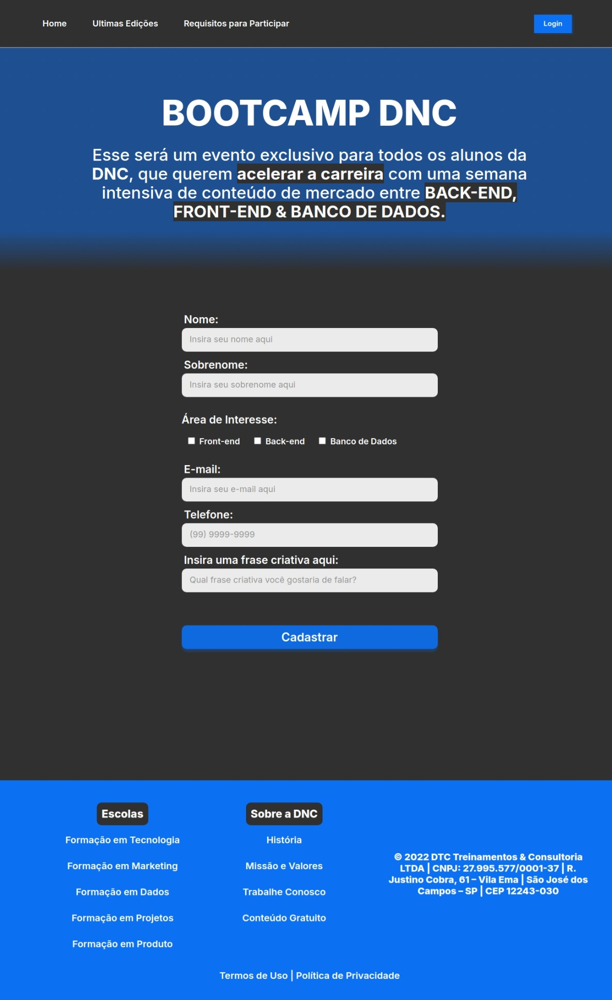

# Bootcamp-DNC

## Página desenvolvida a partir de um designer no FIGMA.
https://www.figma.com/design/GOjJRC68ygIYHMOb0KHa3u/Untitled?node-id=1-2&t=PwGMcJyT201qDIbj-0

link da hospedagem: https://bootcampdnctest.netlify.app/

### **TECNOLOGIAS**
- HTML
- CSS
  - Flexbox
  - Gradients
  - Attr Selectors  
  - Responsive
- Figma
- VSCode
- Git
- Secure Shell(SSH)
- Terminal Linux - Z Shell(Zsh)

Gostei muito desse projeto em particular por conta dos desafios propostos, agradeço a todos os tutores pelo desafio.
links utilizados para desenvolvimento pratico:
- https://www.w3schools.com/
- https://stackoverflow.com/

### Site Finalizado

